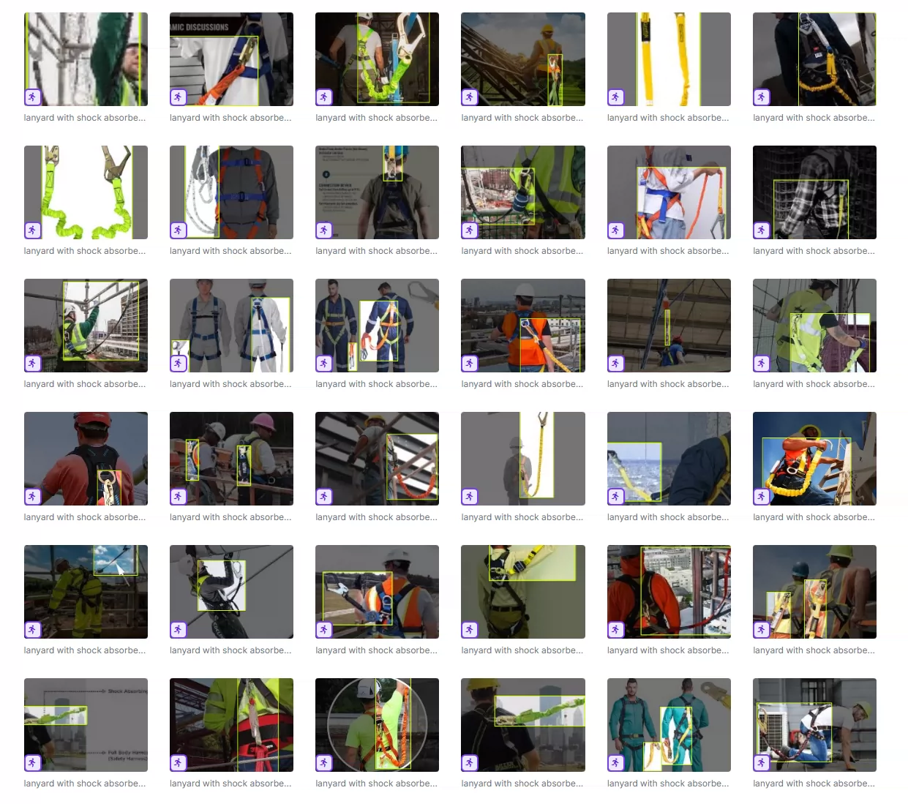
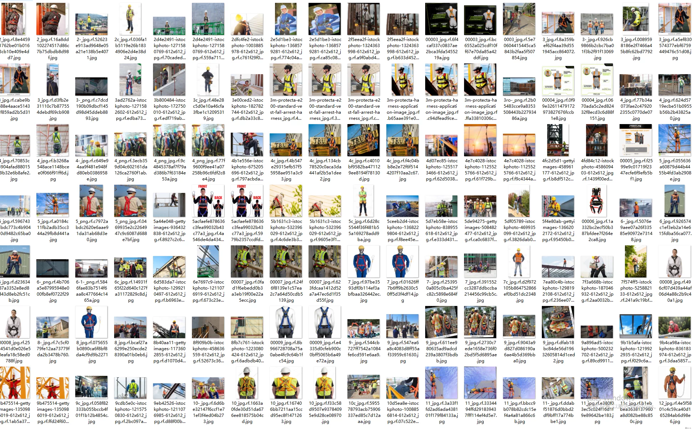
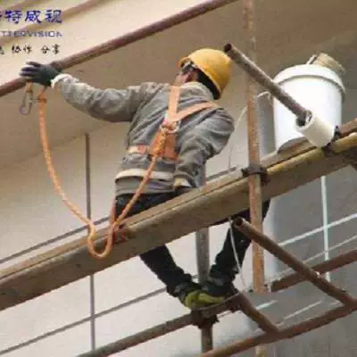
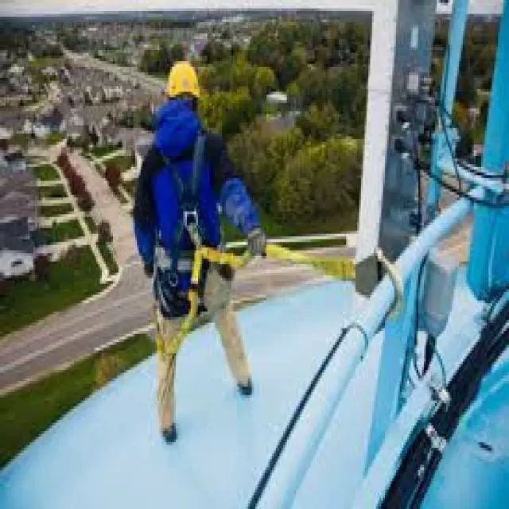

## Body

Safety helmets, helmets, and various construction site safety equipment target detection datasets using YOLO

Totally divided into 44 categories, including: '-no-Halmet', 'Hardhat', 'Harness', 'Harness Jacket', 'Helmet', 'Lifeline', 'No Helmet', 'PPE suit', 'Worker', 'belt', 'body', 'glasses', 'glove', 'gloves', 'hand', 'harnees', 'harness', 'head', 'helmet', 'hook', 'hook-nangan', 'hook-rope', 'hook-rope', 'human', 'jacket', 'lanyard-with-shock-basorber', 'mask', 'no shoes', 'no-front-seftybelt', 'no-jacket', 'no-mask', 'no-safety-belt', 'object', 'person', 'safety belt', 'safety harness', 'safety-belt', 'safety-boots', 'safety-harness', 'safety-helmet', 'safety-vest', 'shoe', 'shoes', 'vest'

"No Safety Hat", "Safety Hat", "Safety Harness", "Safety Harness Jacket", "Helmets", "Lifeline", "No Safety Hat", "Personal Protective Equipment Set", "Worker", "Belt", "Body", "Glasses", "Glove (Singular)", "Glove (Plural)", "Hand", "Safety Harness", "Safety Harness", "Head", "Helmet", "Hook", "Hook - Nangan", "Hook - Rope", "Hook - Rope", "Person", "Jacket", "Lanyard with Shock Absorber", "Mask", "No Shoes", "No Front Safety Belt", "No Jacket", "No Mask", "No Safety Belt", "Object", "Person", "Safety Belt", "Safety Harness", "Safety Belt", "Safety Boots", "Safety Harness", "Safety Helmet", "Safety Vest", "Shoe (Singular)", "Shoe (Plural)", "Vest"

"Electronic virtual products sold are not returnable"

## Images

Here is a pay link on Stripe ( https://buy.stripe.com/3cs8yP7sY87d0vu9AB ). Please contact me lonlonago@foxmail.com after funding $89, and I will send you a complete data files , thank you!

